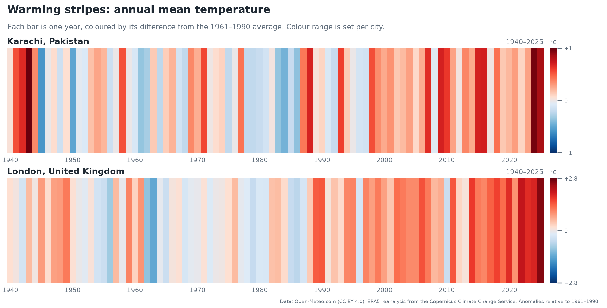
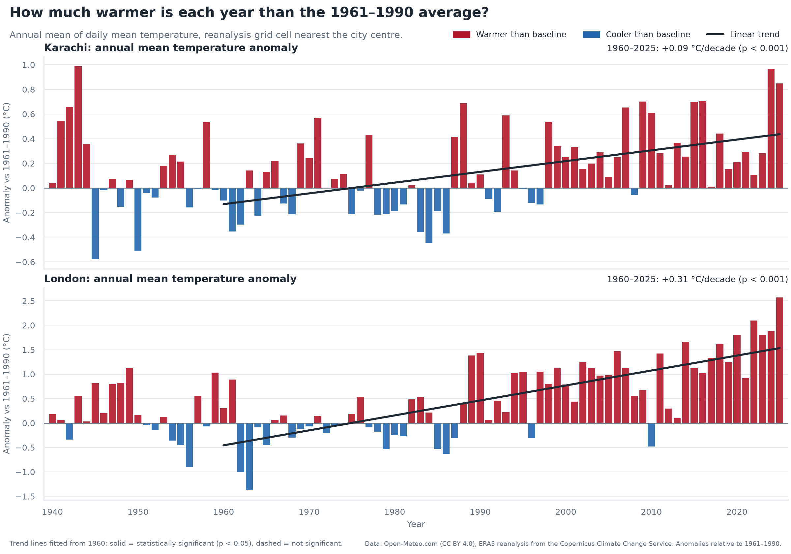
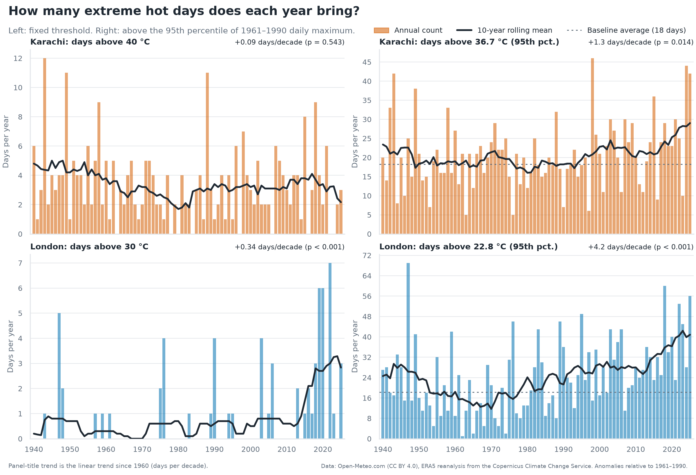
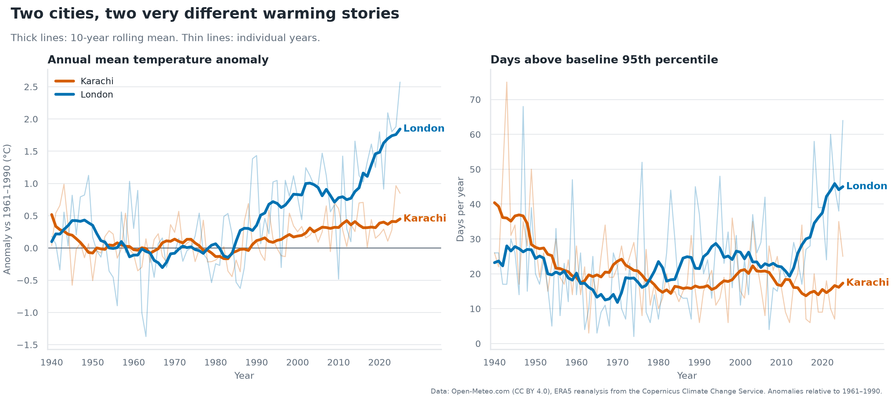
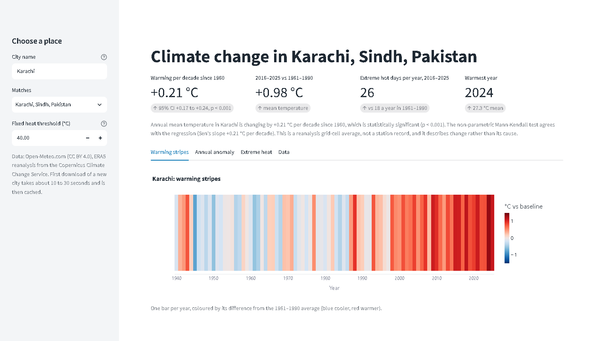

# Climate Change in Two Cities: 1940 to Today

**How have Karachi and London warmed since 1940, and how confident can we be? An end-to-end, reproducible analysis of 86 years of ERA5 reanalysis data, using robust trend statistics.**



*Each bar is one year, coloured by its annual mean temperature relative to the 1961-1990 average (blue = cooler, red = warmer). Karachi (top), London (bottom).*

## Key findings

Trends are for 1960 to 2025. Every temperature result holds under both linear regression and the non-parametric Mann-Kendall test.

- **London is warming faster than Karachi.** Annual mean temperature is rising at **+0.33 °C per decade in London** (95% CI +0.26 to +0.40) and **+0.21 °C per decade in Karachi** (95% CI +0.17 to +0.24), both p < 0.001. The difference between them is statistically significant (p = 0.001).
- **The two cities warm differently.** In Karachi, nights warm faster than days (+0.23 vs +0.17 °C per decade, so the daily range is narrowing). In London, days warm faster than nights (+0.38 vs +0.31 °C per decade).
- **Extreme heat is rising, most sharply in London.** London's days above its own baseline 95th percentile went from **18 a year (1961-1990) to 40 a year (2016-2025)**, and 56 in 2025. Karachi's went from 18 to 26 a year. A fixed 40 °C threshold shows no trend in Karachi, which is why the percentile method is used alongside it.
- **The seasons have shifted.** Between the 1961-1990 and 1991-2020 climate normals, every month warmed in both cities: London by **+1.0 °C** on average (most in April, +1.4 °C) and Karachi by **+0.6 °C** (most in October, +1.0 °C).
- **No detectable rainfall trend.** Annual rainfall, the heaviest rain day and the longest dry spell show no statistically significant change in either city. Rainfall is too variable for 86 years to reveal a small trend.
- **A data-quality catch.** The Open-Meteo API silently switches source model in 1950 by default, which creates a false 0.5-1 °C step in Karachi's record. The pipeline pins a single model (ERA5) so trends are not distorted.

## Selected charts







The full report, with one section per research question, is in [`notebooks/climate_analysis.ipynb`](notebooks/climate_analysis.ipynb). It is saved with all outputs, so it renders fully on GitHub.

## Methods in brief

- **Data:** daily maximum, minimum and mean temperature, precipitation and wind from the Open-Meteo Historical Weather API (ERA5 reanalysis, ~25 km grid), 1 January 1940 to 31 December 2025. Only complete calendar years are used.
- **Anomalies:** annual value minus the 1961-1990 average, the standard 30-year climate baseline.
- **Trends:** linear regression (`scipy.stats.linregress`) for the slope and p-value, plus **Mann-Kendall with Sen's slope** (`pymannkendall`). The non-parametric pair makes no assumption of a straight line or normal errors and is robust to outlier years, so agreement between the two methods means the result does not hinge on the regression's assumptions.
- **Extreme heat, two ways:** (a) days above a fixed threshold per city (40 °C Karachi, 30 °C London); (b) days above the 95th percentile of daily maximum in 1961-1990. The percentile method makes cities with different climates comparable, because about 5% of baseline days exceed it in every city by construction.
- **Rainfall:** annual total, wettest day of the year, and longest run of days under 1 mm.
- **Caution:** autocorrelation is checked (residual lag-1 correlation and the Hamed-Rao adjusted Mann-Kendall test), and results are tested for sensitivity to the trend start year. Nothing here attributes the changes to a cause.

## Tools used

Python 3.12 · requests · pandas · NumPy · SciPy · pymannkendall · matplotlib · seaborn · Plotly · Streamlit · Jupyter · pytest · PyYAML · Git

## How to reproduce

```bash
python -m venv .venv && source .venv/bin/activate   # Windows: .venv\Scripts\activate
pip install -r requirements.txt
python run_all.py
jupyter lab notebooks/climate_analysis.ipynb
```

`run_all.py` fetches the data (skipped if it already exists; add `--force` to re-download), cleans it, runs the analysis and exports the figures. The processed data is committed, so the notebook also runs without downloading anything. Run `python -m pytest` for the 92 unit tests. To add a city, look it up with `python -m src.geocode "City name"`, paste the output into `config.yaml` and re-run `run_all.py`.

## Optional interactive dashboard

Type any city name and the app geocodes it, downloads and caches its 86-year ERA5 history, and shows its warming stripes, annual anomaly with trend, and extreme-heat charts (Plotly, with hover tooltips).

```bash
streamlit run app/dashboard.py
```

The first download of a new city takes about 10 to 30 seconds (longer if the free API is busy) and is cached in `app/cache/`, so later visits are instant. The fixed heat threshold defaults to each city's own 1961-1990 99th percentile of daily maximum.



## Project structure

```
climate-analysis/
├── README.md
├── PROJECT_SUMMARY.md
├── config.yaml              cities, date range, model, baselines, thresholds
├── run_all.py               fetch -> clean -> analyse -> export figures
├── requirements.txt
├── src/
│   ├── config.py            config loading, City type, last complete year
│   ├── geocode.py           Open-Meteo geocoding lookup
│   ├── fetch.py             API download with retries and caching
│   ├── clean.py             reindexing, validation, feature columns
│   ├── analysis.py          anomalies, trends, extremes, dry spells, normals
│   ├── report.py            markdown tables used by the notebook
│   ├── plots.py             all static charts, one consistent style
│   ├── live.py              per-city download cache used by the dashboard
│   └── interactive.py       Plotly versions of the charts for the dashboard
├── app/
│   └── dashboard.py         Streamlit dashboard (optional)
├── notebooks/
│   └── climate_analysis.ipynb   the executed report
├── data/
│   ├── raw/                 API responses, one CSV per city plus metadata
│   └── processed/           cleaned daily data, annual and monthly tables, trend results
├── figures/                 PNG charts (200 dpi)
├── docs/                    dashboard screenshot
└── tests/                   pytest tests on synthetic data with known answers
```

## How the code works

A guide to what each module does, for anyone reading the source.

| Module | Key functions | What they do |
|---|---|---|
| `fetch.py` | `build_params`, `request_with_retries`, `fetch_city` | Builds the API request (pinning `models=era5`), retries on HTTP 429/5xx with exponential backoff, and writes raw CSV plus a metadata file. Skips download if the file exists unless `--force`. |
| `clean.py` | `reindex_daily`, `mask_impossible_values`, `add_features`, `clean_city` | Guarantees one row per day, drops partial years, masks impossible values, adds year, month, diurnal range and wet-day columns. |
| `analysis.py` | `annual_mean`, `anomalies`, `linear_trend`, `mann_kendall_trend`, `slope_difference` | Annual aggregation (a year needs 95% valid days), baseline anomalies, both trend methods, and a z-test for the difference between two slopes. |
| | `count_days`, `baseline_percentile`, `longest_dry_spell`, `longest_run` | Extreme-day counts, the baseline percentile threshold, and the longest run of consecutive dry days within a year. |
| | `monthly_climatology`, `normals_comparison`, `monthly_anomaly_matrix` | Monthly normals, the 1961-1990 vs 1991-2020 comparison and the month by year anomaly grid. |
| `plots.py` | `plot_*`, `export_figures` | Every chart, sharing one style, one colour-blind-safe palette and a source credit. |
| `report.py` | `*_markdown` | Formats analysis results as tables for the notebook. |
| `live.py` | `load_history`, `analyse_place`, `suggest_threshold` | Downloads any city's history into a coordinate-keyed cache, refreshes it when it is out of date, and reuses the same clean and analyse code as the main pipeline. |
| `interactive.py` | `stripes_figure`, `anomaly_figure`, `heat_figure` | Plotly charts for the dashboard. |

## Limitations

- **Reanalysis, not station data.** ERA5 averages a ~25 km grid cell, so city-scale effects such as the urban heat island are not resolved, and the cell is 9 to 15 km from each city centre.
- **Changing observations.** The mix of assimilated observations changes over time (sparser before the 1950s, satellites from 1979), which can affect early trends. Results are checked from several start years.
- **Autocorrelation and multiple tests.** Consecutive years are related, which makes p-values approximate, and many tests are run, so isolated borderline results should not be over-read.
- **Thresholds.** Extreme-day counts depend on the chosen thresholds, and the percentile threshold is a single value for the whole year (not calendar-day).
- **Rainfall** is model-derived and less reliable than temperature.
- **Correlation, not causation.** The analysis measures how much the climate changed, not why.

## Data attribution

Weather data by [Open-Meteo.com](https://open-meteo.com/) (CC BY 4.0), based on ERA5 reanalysis from the Copernicus Climate Change Service.
